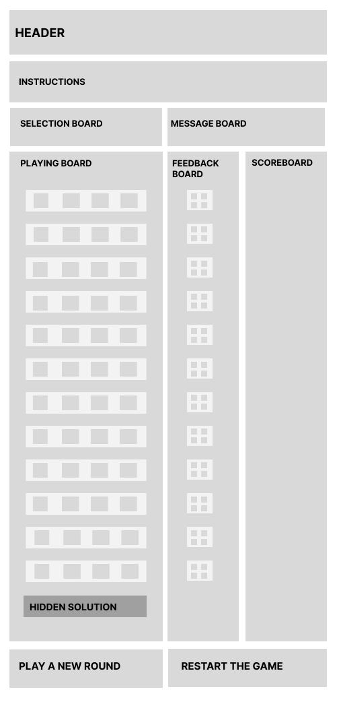
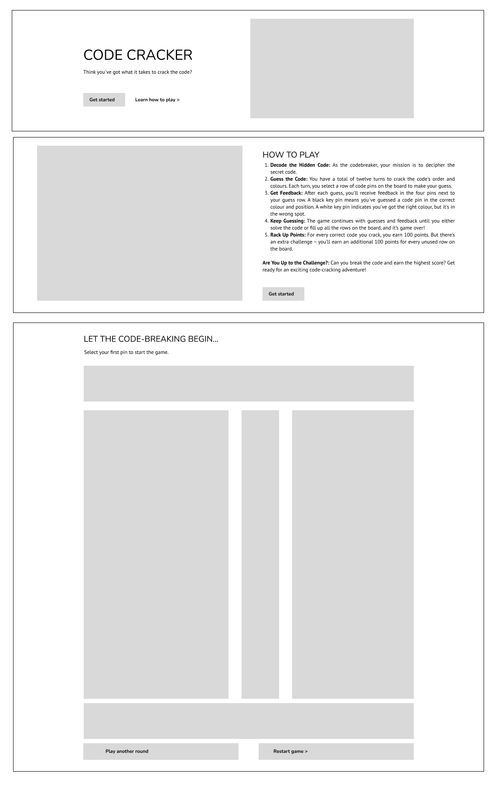

# Mastermind Pseudo Code

## Notes

Initial wireframe for game:

Updated wireframe for game:

## Pseudo Code

### When a user goes to the page:

-   We see an empty game board, with prompts & instructions to start the game by choosing your first guess at the code

    -   The main game board is a grid of twelve (12) guessing rows + one (1) solution row (starting with 5 for ease of build - will add more after)
    -   Each row has four (4) 'spots' where you can place your guess
    -   Next to the game board is the feedback area. This area has four spots for each guessing row, and is where the 'feedback' for your guess is placed.
    -   Above the main game board is the area with all the six (6) possible inputs for the code, here is where the player selects (by clicking) what they are guessing the code is. The clicks need to be done in the order the player wants to guess the code (left to right)
    -   On the far right is the score board, this is updated as rounds are completed
    -   There are two buttons on the very bottom, allowing players to start a new round or restart the game entirely

-   Set the 'code' solution.
    -   Randomise a solution and save this in the solutions array
    -   This is hidden in the 'solution' row

### Wait for a click to happen within the selection area (EVENT)

-   Note which of the six colours of selection is made:
    -   At the next available spot add that selection pin to the next available guess row
-   Check if the guess row is complete (values in all four of the spots):
    -   If no, wait for next click and repeat the above
    -   If yes, review row & give feedback
-   Check if they have guessed the solution:
    -   If no, check if they have reached the final guess row =>
    -   If yes, finish the game
-   Check if they have reached the final guess row
    -   If no, wait for the next click to start on the next guess row
    -   If yes, and there is no 'win', game ends

### How feedback is given

-   Check the guess row has 4 non-zero values (meaning four pins have been selected)
-   Review the first pin in the guesses row:
    -   Check if it is = to the same position pin in the solutions row
        -   If yes, add a black pin to the feedback area (next available spot) & go to next guess pin to check
        -   If no, then check if the pin is = to any of the solutions pins (in any position)
            -   If yes, then add a white pin to the feedback area (next available spot) & go to the next guess pin to check
            -   If no, then go to the next guess pin to check
    -   Continue checks for all four guess pins

### When 'win' is called

When their guess row = solutions row

-   To check if somebody wins:
    -   check latest guess row
    -   all pins in guess row equal all pins in the solutions row (in the right placement also )
-   If true, declare the game won

### When game ends:

-   If there is a win =>
    -   Congratulations / win message is displayed
    -   Score is calculated (see how score is calculated below) and added to the scoreboard
    -   Show the solution row
-   If there is no win (they completed the last guess row and haven't guessed the correct solution) =>
    -   Game over message is displayed
    -   Score = 0 and added to the scoreboard
    -   Show the solution row

### How a score is calculated:

-   The player gets 100 for finding the code, 0 if it is game over
-   In addition, for each guess row they have empty after winning, they receive 100 points.

### When one of the buttons is pressed:

-   'Play another round'
    -   If button is clicked (EVENT), the game board resets, a new solution code is set. The scoreboard remains.
-   'Restart the game'
    -   If button is clicked (EVENT), the game board resets, a new solution code is set, the scoreboard is reset.
